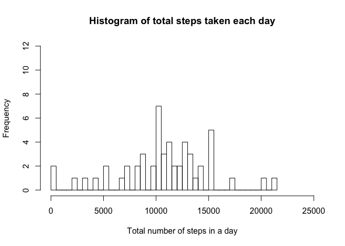
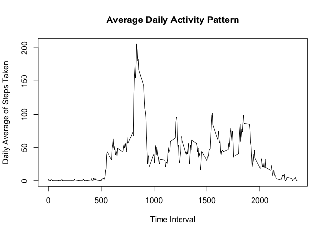

# Average Daily Steps - An Analysis of Personal Activity Data - Reproducible Research Project 1
Hal  
December 29, 2016  


### Synopsis
This paper is my submission for Project 1 for JHU course Reproducible Research. The purpose is to analyze data from a personal activity monitoring device, which collected the number of steps taken at five minute intervals by one person over October and November of 2012. The data show that the subject has a clear pattern of deliberate exercise (probably running), and normally does this in the morning. The subject appears to try to do a minimum of 10,000 steps per day, and often more. Weekends have a different pattern since the subject's behavior is less constrained by a work schedule.

### Loading and preprocessing the data
Here is the code to load the data from a file in the active directory.
Further processing of data will be done as needed to answer questions.

```r
rawdata <- read.csv("activity.csv")
```

### What is mean total number of steps taken per day?
This code calculates the total number of steps taken per day by summing across all 5-minute intervals for each day (eight days are not included because of missing data).

```r
install.packages("dplyr", repos="http://cran.rstudio.com/")
```

```
## 
## The downloaded binary packages are in
## 	/var/folders/8r/swv1rlqs4d94jr9rqd8zl7cr0000gn/T//Rtmp1uJURR/downloaded_packages
```

```r
library("dplyr")
```

```
## 
## Attaching package: 'dplyr'
```

```
## The following objects are masked from 'package:stats':
## 
##     filter, lag
```

```
## The following objects are masked from 'package:base':
## 
##     intersect, setdiff, setequal, union
```

```r
dailysum <- summarise(group_by(rawdata, date), dailytotal = sum(steps))
```

### Make a histogram of the total number of steps taken each day

```r
hist(dailysum$dailytotal, breaks = 50, xlab = "Total number of steps in a day", main = "Histogram of total steps taken each day", xlim = c(0, 25000), ylim = c(0, 12))
```

<!-- -->

### Calculate and report the mean and median of the total number of steps taken per day. 

```r
dailymean = mean(dailysum$dailytotal, na.rm = TRUE)
dailymedian = median(dailysum$dailytotal, na.rm = TRUE)
```
The mean number of steps taken per day is 10766.2.
The median number of steps taken per day is 10765.

### What is the average daily activity pattern?

This plot shows the average daily pattern across intervals throughout the day (missing data is excluded).

### Make a time series plot (i.e. 𝚝𝚢𝚙𝚎 = "𝚕") of the 5-minute interval (x-axis) and the average number of steps taken, averaged across all days (y-axis)

```r
avgdailyact <- summarise(group_by(rawdata, interval), 
                         dailyavg = round(mean(steps, na.rm = TRUE)))
plot(avgdailyact$interval, avgdailyact$dailyavg, type = "l", xlab = "Time Interval", ylab = "Daily Average of Steps Taken", main = "Average Daily Activity Pattern")
```

<!-- -->

### Which 5-minute interval, on average across all the days in the dataset, contains the maximum number of steps?

```r
maxavgdailyact <- avgdailyact$interval[which.max(avgdailyact$dailyavg)]
```
The time interval containing the maximum average number of steps is 835.

### Calculate and report the total number of missing values in the dataset (i.e. the total number of rows with 𝙽𝙰s)

```r
totalNA <- sum(is.na(rawdata))
```
There are 2304 missing values in the dataset. For example, the first day has missing data, as seen in the first three lines of the dataset:

```r
head(rawdata, 3)
```

```
##   steps       date interval
## 1    NA 2012-10-01        0
## 2    NA 2012-10-01        5
## 3    NA 2012-10-01       10
```

### Devise a strategy for filling in all of the missing values in the dataset. 
Missing values have been imputed by substituting the corresponding mean for each 5-minute interval which had missing data.  

```r
impdata <- cbind(rawdata, dailysteps = avgdailyact$dailyavg)
impdata$steps[is.na(impdata$steps)] <- impdata$dailysteps
```

```
## Warning in impdata$steps[is.na(impdata$steps)] <- impdata$dailysteps:
## number of items to replace is not a multiple of replacement length
```

### Create a new dataset that is equal to the original dataset but with the missing data filled in.

```r
fulldata <- select(impdata, steps, date, interval)
```
A dataset named "fulldata" includes these imputed data points. For example, the new data is seen below in the first three lines of the new dataset, as compared to the original dataset's first three lines, seen above.

```r
head(fulldata, 3)
```

```
##   steps       date interval
## 1     2 2012-10-01        0
## 2     0 2012-10-01        5
## 3     0 2012-10-01       10
```

### Make a histogram of the total number of steps taken each day and calculate and report the mean and median total number of steps taken per day. Do these values differ from the estimates from the first part of the assignment? What is the impact of imputing missing data on the estimates of the total daily number of steps?

```r
fulldailysum <- summarise(group_by(fulldata, date), dailytotal = sum(steps))
hist(fulldailysum$dailytotal, breaks = 50, xlab = "Total number of steps in a day", main = "Histogram of total steps taken each day", xlim = c(0, 25000), ylim = c(0, 12))
```

<!-- -->


```r
fulldailymean = mean(fulldailysum$dailytotal)
fulldailymedian = median(fulldailysum$dailytotal)
```
After missing data is imputed, the mean number of steps taken per day is 10765.6, versus 10766.2. The median number of steps taken per day is 10762, versus 10765 before imputing missing data. With missing data imputed, the mean and median number of steps are slightly lower than when excluding missing data, but not significantly. 

### Are there differences in activity patterns between weekdays and weekends? Create a new factor variable in the dataset with two levels – “weekday” and “weekend” indicating whether a given date is a weekday or weekend day.

```r
fulldata$date <- as.POSIXct(fulldata$date)
fulldata$day <- weekdays(fulldata$date)
weekdays1 <- c("Monday", "Tuesday", "Wednesday", "Thursday", "Friday")
fulldata$daytype <- factor((weekdays(fulldata$date) %in% weekdays1), 
                           levels=c(FALSE, TRUE), 
                           labels=c('weekend', 'weekday'))
```
There are noticeable differences between the activity levels on weekdays and on weekends. These can be seen by comparing the two plots below. The first shows average number of steps taken by 5-minute intervals averaged across weekdays, and the second shows similar data for weekends.


```r
install.packages("lattice", repos="http://cran.rstudio.com/")
```

```
## 
## The downloaded binary packages are in
## 	/var/folders/8r/swv1rlqs4d94jr9rqd8zl7cr0000gn/T//Rtmp1uJURR/downloaded_packages
```

```r
require("lattice")
```

```
## Loading required package: lattice
```

```r
avgsteps <- summarise(group_by(fulldata, interval, daytype), intav = round(mean(steps)))
xyplot(intav ~ interval | daytype, data = avgsteps, type = "l", layout = c(1, 2), ylab = "steps")
```

<!-- -->

One can see that during weekdays, more steps are taken in the intervals before the workday starts; during weekends, activity is spread more throughout the day and is higher during the day than on a weekday, when the subject of the data is likely to be at work. 


